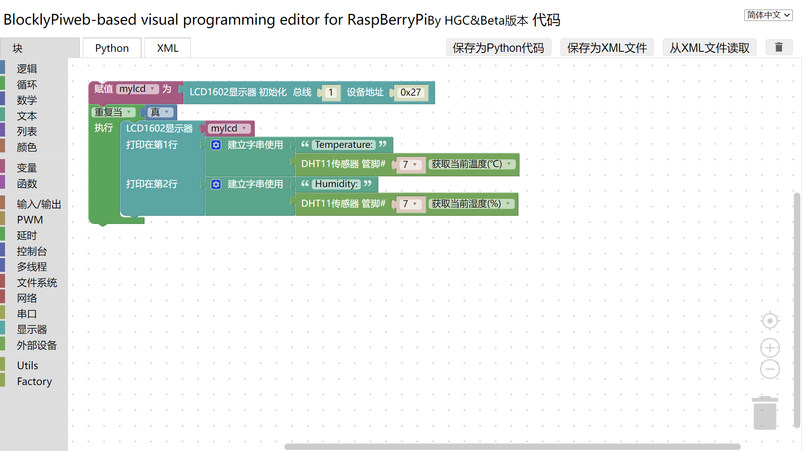
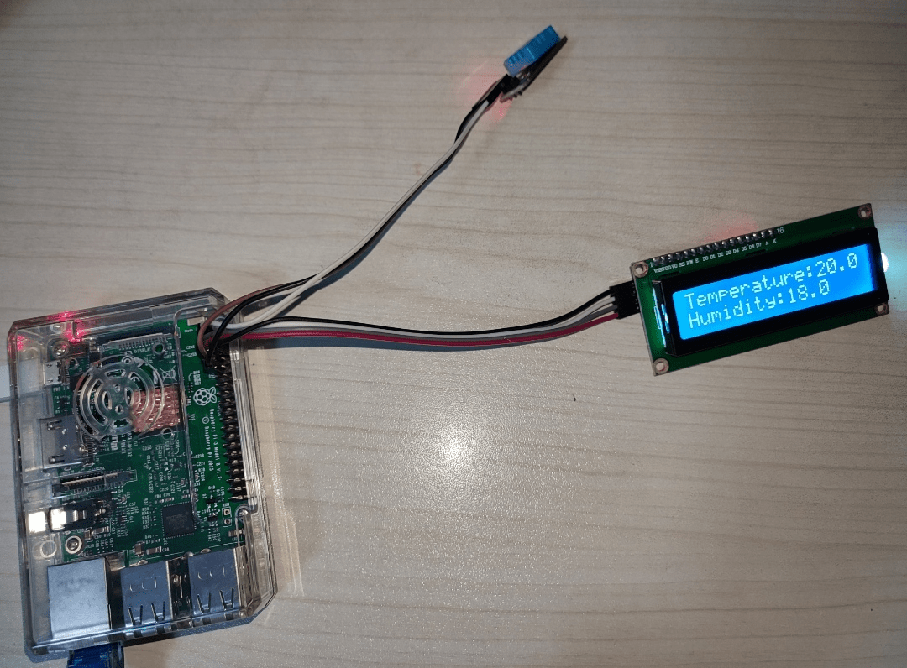

# BlocklyPi beta

#### 项目介绍
本项目是一个基于Blockly的树莓派可视化编程软件,可以通过模块化编程操控树莓派的GPIO，基于Python和RPi.GPIO

#### 软件架构
基于HTML，Javascript的在线编辑器


#### 使用说明

见项目 `apps/blocklypi/index.html` 地址

进行串口通信时需要先执行sudo apt-get install python-serial安装相应的扩展包

使用显示器LCD1602模块时需要开启iic功能并执行sudo apt-get install python-smbus安装相应的扩展包，LCD1602的驱动库在python_libraries/lcd1602目录下

DHT11温湿度传感器的驱动库在python_libraries/dht11目录下

ADS1115电压传感器的驱动库在python_libraries/ads1115目录下

步进电机的驱动库在python_libraries/stepper目录下

更多说明详见Blockly


#### 实际使用
详见 [http://hgcserver.gitee.io/blocklypi/apps/blocklypi/index.html](http://hgcserver.gitee.io/blocklypi/apps/blocklypi/index.html)



#### 特别说明
本版本为BlocklyPi beta版本，对第一代进行了重写，抛弃了Wiringpi而使用Python，功能相比于第一代更为强大，但是仍可能存在许多不足(可能在编写时没有发现)，如在使用过程中产生问题，请及时在issues中指出。

另外，原生Blocks编译为python_compressed.js(参见官方的Blockly源码)，树莓派的javascript在pi文件夹下。分blocks和generators两个文件夹 。参考下图:

```
//定义blocks
Blockly.Blocks.XXX = {
    //Some Code...
}
//定义generators
Blockly.Python.XXX=function(){
   //Some Code...
};